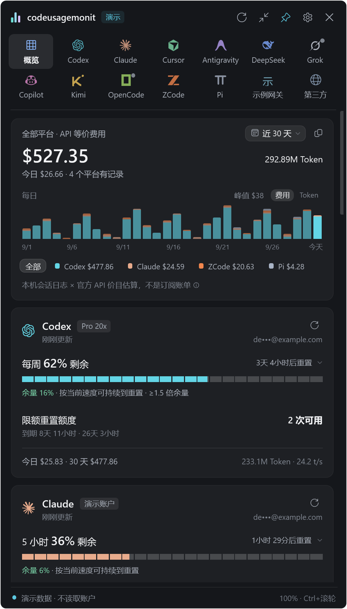
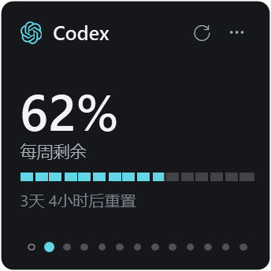
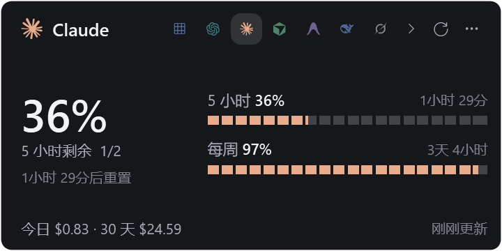

<p align="center">
  
</p>

<h1 align="center">codeusagemonit</h1>

<p align="center"><strong>写代码，不必猜额度。</strong><br />Windows 原生 AI 编程用量监控，把额度、重置时间和本机用量收进一个托盘图标。</p>

<p align="center">
  <a href="https://codeusagemonit.lfc1176.chatgpt.site">官网</a> ·
  <a href="https://github.com/fanchengliu/codeusagemonit/releases">下载</a> ·
  <a href="#支持的平台">平台文档</a> ·
  <a href="https://github.com/fanchengliu/codeusagemonit/issues">反馈</a>
</p>

<p align="center">
  
  <a href="https://github.com/fanchengliu/codeusagemonit/releases/tag/v1.1.0"></a>
  <a href="LICENSE"></a>
  
</p>

<p align="center">
  
  <br /><sub>1.1.0 实际界面 · 演示数据</sub>
</p>

## 下载与安装

**[下载 Windows x64 v1.1.0](https://github.com/fanchengliu/codeusagemonit/releases/download/v1.1.0/codeusagemonit-1.1.0-win-x64.zip)** · [查看所有 Releases](https://github.com/fanchengliu/codeusagemonit/releases)

1. 将压缩包**完整解压**到可写目录，例如 `D:\Apps\codeusagemonit`。
2. 双击 `codeusagemonit.exe`。不要只复制 exe；保留旁边的 XAML、图标和价格表。
3. 在托盘打开面板，启用要看的平台，复用已有登录或点击卡片里的「连接」。

Windows x64，使用系统 .NET Framework 4.x / WPF。**无需 Node.js、Python、WSL 或 ccusage。** 本软件自身不要求这些运行时；所监控的 CLI / 编辑器仍需按各自方式安装。

更新时先从托盘退出，备份并保留原目录的 `data` 文件夹，再用新版程序文件覆盖。最新版本与更新说明统一放在 [Releases](https://github.com/fanchengliu/codeusagemonit/releases)。

## 为什么使用它

| 你想知道 | codeusagemonit 展示什么 |
| --- | --- |
| 还能继续用多久 | 账户剩余额度、重置倒计时、使用节奏；各平台可单独刷新 |
| 这段时间用了多少 | 自选日期与时间，查看 Token、请求、模型构成和 API 等价费用 |
| 实际输出有多快 | 对有计时记录的平台计算输出 Token/s，按平台和模型查看 |
| 桌面需要留多大空间 | 小 / 中 / 大 / 完整四种视图，各自可拖动、调整大小并记住位置 |
| 想要自己的外观 | 背景调色盘、界面透明度、背景图片与独立设置窗口 |
| 不想打开窗口 | 随附 `codeusage.exe`，在终端查询或导出 JSON |

费用由原生引擎逐次请求计价，使用随包附带的离线 `pricing.json`。**显示金额是 API 等价估算，不是你的订阅账单。** 缺失字段不会被冒充为零；查询失败时保留上次成功数据和时间标记。

## 一个窗口，四种视图

| 小 | 中 |
| --- | --- |
|  |  |
| 专注一个关键额度 | 多个额度窗口并排查看 |

大视图加入图表、时间筛选和用量统计；完整视图集中展示概览与平台详情。四种尺寸均可切换平台、独立刷新和连接账号，设置在单独窗口打开。

## 支持的平台

点平台名称查看连接方法、数据来源与限制。

| 平台 | 连接方式 | 主要数据 |
| --- | --- | --- |
| [Codex](docs/providers/codex.md) | OAuth | 周期额度、重置额度、本机 Token / 费用 / 速度 |
| [Claude](docs/providers/claude.md) | OAuth | 5 小时 / 每周额度、本机 Token / 费用 / 速度 |
| [Cursor](docs/providers/cursor.md) | 本地编辑器会话 → Cookie 请求头 | 套餐总量、Auto、API / 手动模型额度 |
| [Antigravity](docs/providers/antigravity.md) | 本地服务，OAuth 回退 | 模型 / 周期额度、本机会话统计 |
| [DeepSeek](docs/providers/deepseek.md) | API Key | 按币种展示 API 账户余额 |
| [Grok](docs/providers/grok.md) | CLI 会话 | 订阅账期额度、本机 Token / 费用 / 速度 |
| [Copilot](docs/providers/copilot.md) | OAuth 设备流 / 现有授权 | 每月高级请求、对话等额度；CLI 本机日志 |
| [Kimi](docs/providers/kimi.md) | Kimi Code API Key | 5 小时 / 每周 / 每月额度、CLI 本机用量 |
| [OpenCode](docs/providers/opencode.md) | OpenCode Go API Key | Go 周期额度、本机历史 |
| [ZCode](docs/providers/zcode.md) | 智谱 / Z.ai API Key | GLM 编码套餐、MCP 额度、CLI 本机用量 |
| [Pi](docs/providers/pi.md) | 本地文件 | 本机 Token、请求和费用估算 |
| [自定义接口](docs/providers/custom.md) | API Key / 自定义请求头 | 将 JSON 字段映射为额度、余额与重置时间 |

Copilot、Kimi、OpenCode、ZCode、Pi 默认关闭，可在设置中启用。**Pi、Copilot CLI、OpenCode 的本机日志读取在 1.1.0 开发机缺少真实样本验证**，具体兼容性见平台文档。

## 命令行

在解压目录中运行；CLI 与桌面版共享 `data` 中的设置和缓存。

```powershell
# 查看缓存中的额度与用量，不联网
.\codeusage.exe status

# 实时查询一个平台
.\codeusage.exe usage -p codex

# 重新扫描近 30 天本机记录，导出 JSON
.\codeusage.exe cost --days 30 --refresh --json

# 查看第三方接口的本机用量
.\codeusage.exe thirdparty
```

运行 `.\codeusage.exe help` 查看全部命令。

## 数据与隐私

- **复用已有会话。** 读取已启用平台的 CLI / 编辑器凭据，或通过 GitHub 设备码与 API Key 连接。不存储密码。
- **不导入浏览器 Cookie。** Cursor 从本机编辑器会话生成 Cookie 请求头，和扫描浏览器 Cookie 数据库不同。
- **密钥留在本机。** 手动填写的密钥和 Copilot 设备流令牌使用 Windows DPAPI 加密；网络查询只发送到对应提供商或你配置的自定义接口。
- **本机统计保存数值。** 读取已知会话目录，索引 Token、模型、请求和耗时，不保存对话正文。
- **可控制数据源。** 关闭的平台不再查询额度；自定义接口仅发 GET，不跟随重定向，并限制响应大小与超时。

不要把自己的 `data/`、凭据文件或含账号内容的截图提交到仓库。问题报告可只附版本、错误提示、平台名和脱敏后的最小样本。

## 从源码构建

**1.1.0 的对应完整源码位于发布 ZIP 的 `source/Windows/`。** 仓库根目录的旧客户端源码属于历史版本，不能当作 1.1.0 源码直接构建。版本分支用于保留发布历史；官网源码位于 [`website/`](website/)。

在已解压的 1.1.0 包中，用 Windows PowerShell 执行：

```powershell
powershell -NoProfile -ExecutionPolicy Bypass -File .\source\Windows\build.ps1 -OutputDirectory .\build
```

构建脚本使用系统的 .NET Framework 4.x C# 编译器，同时生成桌面版和 CLI。建议输出到独立目录，避免覆盖正在使用的程序。

## 参与改进

欢迎提交 [Issue](https://github.com/fanchengliu/codeusagemonit/issues) 或 Pull Request：平台接口适配、文档、界面、日志解析和脱敏样本都能帮助项目进步。涉及 1.1.0 客户端的修改请注明以发布包源码为基础，避免与旧版本混淆。

## 致谢与许可证

项目使用 [MIT License](LICENSE)。codeusagemonit 是独立的 Windows 实现，不是 CodexBar、ccusage 或任何被监控平台的官方产品。

界面思路参考 [CodexBar](https://github.com/steipete/CodexBar)，日志格式研究参考 [ccusage](https://github.com/ccusage/ccusage)，价格数据整理自 [LiteLLM](https://github.com/BerriAI/litellm) 和 [models.dev](https://github.com/anomalyco/models.dev)。程序没有调用 CodexBar 或 ccusage；平台图标来自 CodexBar 的 MIT 资源，品牌与商标归各自所有者。完整说明见发布包中的 `THIRD-PARTY-NOTICES.md` 和 `licenses/`。
