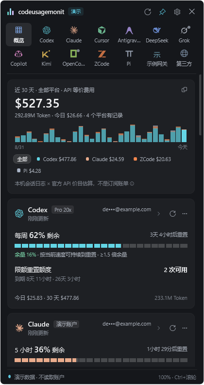
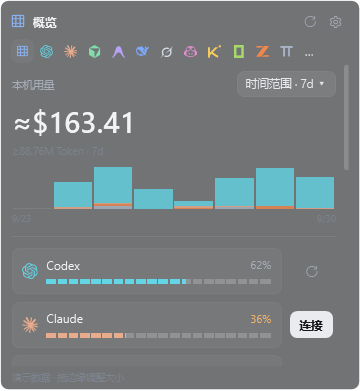
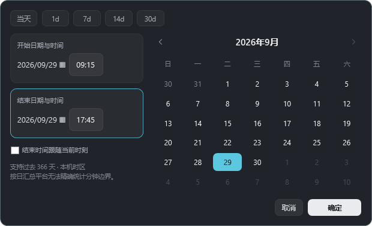

# codeusagemonit

Windows 原生 AI 编程助手用量监控：额度、本机 Token、API 等价费用与输出速度。

**[项目官网](https://codeusagemonit.example.chatgpt.site)** · **[下载 Windows 1.1.0](downloads/codeusagemonit-1.1.0-win-x64.zip?raw=true)** · [网站源码](website/)

当前发布版本为 **1.1.0**。该版本的完整 Windows 源码随便携包提供，位于解压后的 `source/Windows/`。官网截图来自 1.1.0 的演示模式。

## 官网

网站包含真实界面展示、平台列表、尺寸切换预览、命令行用法与常见问题。纯静态源码位于 [`website/`](website/)，无需依赖安装即可运行。

## 版本分支

- [`v1.1`](https://github.com/fanchengliu/codeusagemonit/tree/v1.1)：1.1.0 原始发布包。
- [`v0.8`](https://github.com/fanchengliu/codeusagemonit/tree/v0.8)、[`v0.7`](https://github.com/fanchengliu/codeusagemonit/tree/v0.7)、[`v0.6`](https://github.com/fanchengliu/codeusagemonit/tree/v0.6)：对应历史源码与发布包。
- [`website`](https://github.com/fanchengliu/codeusagemonit/tree/website)：项目官网页面。

<details>
<summary>0.8 版本的历史开发说明</summary>

专为 Windows 设计的 AI 编程工具用量监控：一个托盘图标，集中查看账户额度、重置时间与本机 Token 用量。

基于 C# / WPF，MIT 开源。界面和部分额度解析逻辑参考 [CodexBar](https://github.com/steipete/CodexBar)，这是独立 Windows 实现，并非 CodexBar 官方 Windows 版本。

## 下载与运行

**[下载 Windows x64 便携版 0.8.0](downloads/codeusagemonit-0.8.0-win-x64.zip?raw=true)** · [SHA-256](downloads/codeusagemonit-0.8.0-win-x64.zip.sha256)

完整解压到可写目录，双击 `codeusagemonit.exe`。程序会在同级 `data` 目录保存设置和缓存。需要 Windows x64 和 .NET Framework 4.8；原生毛玻璃适用于支持系统背景材质的 Windows 11，其他系统回退为实色背景。

## 功能

- **11 个内置平台**：Codex、Claude Code、Cursor、Antigravity、DeepSeek、Grok、GitHub Copilot、Kimi Code、OpenCode、ZCode、Pi。另可配置自己的 HTTP JSON 用量接口。
- **四种可调布局**：小尺寸大数字与圆点切换，中尺寸横向双栏，大尺寸详细额度与图表，完整面板集中展示；都有概览，可调整宽高并记住位置，默认不置顶。平台切换使用图标。
- **分段额度条**：显示服务商实际返回的剩余额度、重置倒计时、用量节奏及支持的平台信息。缺失的数据保持未知。
- **日期与时间筛选**：每个平台独立选择当天、1d、7d、14d、30d，或用日历和 HH:mm 指定起止时间；支持结束时间跟随当前时刻，费用、Token 与图表同步筛选。
- **就地操作**：切换平台、独立刷新、点击额度看明细、复制区间用量；连接按钮在当前布局内打开登录或密钥表单，保持窗口大小。
- **独立设置窗口**：设置单独弹出，主面板继续更新；取消或关闭可恢复透明度预览。
- **本机历史**：30 天图表可按平台筛选；金额为 API 等价估算，不是订阅账单。Pi 仅有本机历史，DeepSeek 显示余额。
- **Windows 外观**：仅毛玻璃，界面透明度 0–100（0 为不透明），界面缩放 80–140%；概览中的额度条总宽统一对齐。
- **命令行**：附带 `codeusage.exe`，支持缓存查询、实时额度、本地费用、第三方接口用量和 JSON 输出。

| 完整概览 | 大尺寸概览 |
| --- | --- |
|  |  |

截图均为演示数据。更多操作见 [中文使用说明](使用说明.md)，实现与平台接入说明见 [Windows 开发文档](source/Windows/README.md)。



日历支持过去 366 天内的本机记录。Codex / Claude 的分钟边界按小时索引估算并标注；只有日汇总的平台会排除不完整日期，不把整天用量冒充某几个小时的用量。缺失记录不会补造。

## 构建与验证

在仓库根目录运行 PowerShell：

```powershell
& .\source\Windows\build.ps1
.\codeusagemonit.exe --self-test
.\codeusagemonit.exe --demo
```

构建使用系统自带的 .NET Framework C# 编译器，不需要 Node.js、Rust 或 Swift。仓库中附带 MIT 许可的 `tools/ccusage.exe` 20.0.26，用于本机历史统计及离线价格估算；构建出的 GUI 和 CLI 默认写到根目录。

隔离的界面回归和便携包构建：

```powershell
& .\source\Windows\build.ps1 -OutputDirectory .\verification\preview
& .\source\Windows\verify-regression.ps1 -OutputDirectory .\verification\preview
& .\source\Windows\package.ps1
```

0.8.0 已通过 59 项自检和 22 项离线 WPF 界面回归。新增验证包括时间边界、时区、区间统计、日历输入和保存、平台选择独立性、额度条对齐及三种不同的紧凑排版。界面测试使用模拟账号，未逐个平台执行真实账号授权。详细范围见 [验证记录](source/Windows/VERIFICATION.md)。

## 隐私与限制

- 复用对应 CLI / 编辑器已有的登录状态，不导入浏览器 Cookie。
- 手工输入的 API Key 使用当前 Windows 用户的 DPAPI 加密保存；使用原应用登录时，令牌留在原应用。
- 本机历史来自会话日志；缓存可能包含邮箱、用量及接口地址。`data/`、日志和测试输出已加入忽略规则，请勿提交自己的运行目录。
- 账户额度依赖平台接口与登录状态；平台变动、区域限制、网络或代理配置可能影响读取。
- 不消费限额重置额度，不调用模型生成内容来测试可用性。

## 目录

```text
source/Windows/     C# / WPF 源码、构建、测试和打包脚本
icons/             平台 SVG 图标
tools/             本机历史统计组件 ccusage
licenses/          第三方 MIT 许可证
docs/screenshots/  演示界面截图
downloads/         已校验的 Windows 便携包
```

## 许可与致谢

[MIT License](LICENSE)。感谢 [CodexBar](https://github.com/steipete/CodexBar)、[Claude Code Usage Monitor](https://github.com/CodeZeno/Claude-Code-Usage-Monitor) 和 [ccusage](https://github.com/ccusage/ccusage)。移植范围、基线版本及完整许可见 [THIRD-PARTY-NOTICES.md](THIRD-PARTY-NOTICES.md)。服务名称和标志属于各自权利人，本项目不隶属于这些平台。

</details>
