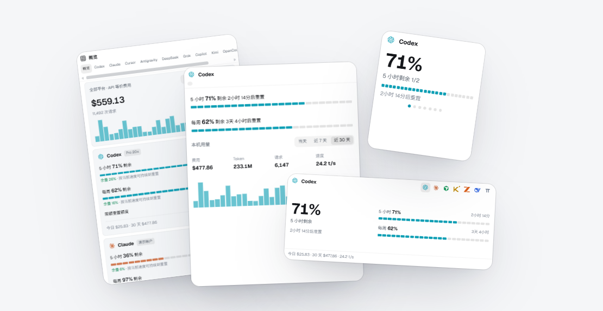

<div align="center">


# codeusagemonit

**Windows 托盘里的 AI 编程额度与用量监控**

Codex、Claude、Cursor 等 11 款编程工具的剩余额度、重置时间、Token 用量和输出速度，放在一个小窗口里。

[](https://github.com/fanchengliu/codeusagemonit/releases/latest)
[](https://github.com/fanchengliu/codeusagemonit/releases)
[](./LICENSE)
[](#安装)

[官网](https://codeusagemonit.vercel.app) · [下载](https://github.com/fanchengliu/codeusagemonit/releases/latest) · [详细使用说明](./使用说明.md) · [更新记录](https://github.com/fanchengliu/codeusagemonit/releases)

**简体中文** · [English](./README.en.md)



</div>

## 简介

同时用好几家 AI 编程工具时，额度窗口各不相同：有 5 小时的，有每周的，有按月的，重置时间也不一样。本机日志散落在各自的目录里，走中转站的用量更是无从查起。

codeusagemonit 把这些信息收到 Windows 托盘里：左键点开就能看到每个平台还剩多少、什么时候重置、按现在的速度能不能撑到重置；本机用量、API 等价费用和输出速度也一并统计。它是原生 C# / WPF 程序，另附命令行工具 `codeusage`。免费开源，MIT 许可。

## 主要功能

- **额度一目了然**：每个额度窗口一条 24 格进度条，亮着的是剩余部分；下方提示当前节奏是“有余量”还是“超前消耗”，并估算用尽时间。点开额度行可以看精确的重置时间。
- **本机用量与费用**：直接读取各工具保存在本机的会话日志，按小时、按模型统计 Token 和请求数，用官方 API 单价逐次请求估算费用。支持自选时间段，柱状图可以点开看某一天或某一小时的明细。
- **价目表每天同步**：内置 361 个模型的官方价格（整理自 LiteLLM 与 models.dev），计入缓存读写、长上下文分档和 Codex fast 档倍率。程序每 24 小时检查一次更新，可以关闭，断网时用内置价目。
- **真实输出速度**：输出 Token ÷ 整个请求耗时，包含首字延迟和中转站延迟，每个工具单独计算。反映的是实际用起来的快慢，不是模型跑分。
- **中转站用量**：Claude Code 或 Codex 接第三方接口时，用量单独显示在「第三方」页，并归到具体的接口。用 CC Switch 来回切换供应商也能分清。
- **自定义平台**：任何返回 JSON 的 GET 接口（中转站后台、自建网关等）写一段 JSON 定义就能接入，和内置平台一样显示额度条。
- **四种尺寸**：完整面板，以及贴在桌面上的大、中、小三种紧凑视图，右键随时切换，每种尺寸都能拖动调整大小。
- **外观可调**：背景颜色（调色盘和 10 个预设）、界面透明度、背景图片、界面缩放（Ctrl + 滚轮）。
- **命令行**：`codeusage` 与桌面版共用设置、密钥和缓存，支持 `--json`，方便接进脚本或状态栏。
- **数据留在本机**：不读浏览器 Cookie，不保存对话内容，没有遥测。

## 界面

同一个窗口有四种尺寸：顶部“显示尺寸”按钮、窗口任意处右键或托盘菜单都能切换。


浅色主题：左边是完整面板，中间是大尺寸，右上是小尺寸，右下是中尺寸。

## 支持的平台

| 平台 | 连接方式 | 显示的额度 | 本机用量 | 输出速度 |
| --- | --- | --- | :---: | :---: |
| [Codex](./docs/providers/codex.md) | 复用 Codex CLI 或 Codex 应用的登录 | 账户返回的周期额度（如 5 小时、每周）、限额重置额度 | ✓ | ✓ |
| [Claude](./docs/providers/claude.md) | 复用 Claude Code 的登录 | 5 小时、每周及模型额度 | ✓ | ✓ |
| [Cursor](./docs/providers/cursor.md) | 读取 Cursor 编辑器保存的会话 | 套餐总量、Auto、API；账户包含时另显示 Grok Bot 每周额度 | — | — |
| [Antigravity](./docs/providers/antigravity.md) | 读取正在运行的桌面应用，已保存的登录作为回退 | 周期额度、模型额度 | ✓ | — |
| [DeepSeek](./docs/providers/deepseek.md) | API Key（或环境变量 `DEEPSEEK_API_KEY`） | API 账户余额，按币种显示 | — | — |
| [Grok](./docs/providers/grok.md) | 复用 Grok Build CLI 的登录（`grok login`） | 当前账期的订阅额度 | ✓ | ✓ |
| [GitHub Copilot](./docs/providers/copilot.md) | GitHub 设备码登录，或复用官方插件已保存的授权 | 每月高级请求、对话额度 | ✓ | — |
| [Kimi Code](./docs/providers/kimi.md) | API Key，可选国内或国际 | 5 小时、每周、每月 | ✓ | — |
| [OpenCode Go](./docs/providers/opencode.md) | API Key | 5 小时、每周、每月 | ✓ | ✓ |
| [ZCode（智谱 / Z.ai）](./docs/providers/zcode.md) | API Key（GLM 编码套餐），可选国内或国际 | 5 小时、每周、MCP 工具调用 | ✓ | ✓ |
| [Pi](./docs/providers/pi.md) | 无需登录 | 没有账户额度，只统计本机用量 | ✓ | — |
| [自定义平台](./docs/providers/custom.md) | 任意返回 JSON 的 GET 接口，密钥单独加密保存 | 最多 6 个额度窗口，或余额 | — | — |

- 前六个平台默认启用，其余在 设置 → 显示的平台 里打开。
- 各平台的数据来源、连接步骤和限制见 [`docs/providers/`](./docs/providers/)。

## 安装

需要 Windows 10 / 11（x64）。系统自带的 .NET Framework 4.8 即可运行，不需要 Node.js，默认安装方式都不需要管理员权限。

### 安装程序（推荐）

从 [Releases](https://github.com/fanchengliu/codeusagemonit/releases/latest) 下载 [codeusagemonit-setup-1.2.0.exe](https://github.com/fanchengliu/codeusagemonit/releases/download/v1.2.0/codeusagemonit-setup-1.2.0.exe) 运行。

- 默认装到 `%LOCALAPPDATA%\Programs\codeusagemonit`，也可以换目录或盘符。
- 创建开始菜单快捷方式；桌面快捷方式、开机启动、把 `codeusage` 加入用户 PATH 都可选。
- 升级：运行新版安装程序即可，设置和密钥保留。卸载：Windows 设置 → 应用，卸载前会询问是否删除设置。

### Scoop

```powershell
scoop bucket add codeusagemonit https://github.com/fanchengliu/codeusagemonit
scoop install codeusagemonit
```

会创建开始菜单快捷方式，终端里可以直接用 `codeusage`。以后用 `scoop update codeusagemonit` 升级，`data` 文件夹在 Scoop 的 persist 目录里，升级不丢。还没装 Scoop 的话，先运行 `irm get.scoop.sh | iex`。

### PowerShell 一行安装

```powershell
irm https://raw.githubusercontent.com/fanchengliu/codeusagemonit/main/install.ps1 | iex
```

脚本从 GitHub Releases 下载最新版并自动校验完整性，装到 `%LOCALAPPDATA%\Programs\codeusagemonit`，把 `codeusage` 加进用户 PATH，并创建开始菜单快捷方式。再运行一次就是升级。卸载时删除该目录，并从用户 PATH 中去掉它。

### 免安装 zip

从 [Releases](https://github.com/fanchengliu/codeusagemonit/releases/latest) 下载 `codeusagemonit-<版本>-win-x64.zip`，解压到任意可写的文件夹，双击 `codeusagemonit.exe`。升级时覆盖旧文件，保留旁边的 `data` 文件夹。

> [!NOTE]
> 程序没有代码签名，首次运行时 Windows 可能提示“Windows 已保护你的电脑”，点 **更多信息 → 仍要运行** 即可。

## 上手

1. 启动后程序常驻托盘。**左键**点托盘图标展开或收起窗口，**右键**打开菜单（刷新、设置、显示尺寸、退出等）。关闭窗口不会退出程序。
2. 没连接的平台会在卡片上显示“连接”按钮，按提示操作即可：Codex、Claude、Grok 在终端里登录；Cursor、Antigravity 在各自应用里登录；API Key 类平台直接在卡片里粘贴 Key；Copilot 用 GitHub 设备码授权。
3. 默认每 5 分钟刷新一次，也可以按 F5 或点某个平台卡片上的刷新按钮只刷新它。

想先看看效果，可以运行 `codeusagemonit.exe --demo`：使用演示数据，不读取账户、不联网，也不会改动正式设置。

更多操作（时间段选择、各尺寸的交互、设置项、自定义平台的 JSON 格式、中转站用量的归属规则等）见 [使用说明](./使用说明.md)。

## 命令行

`codeusage.exe` 和桌面版在同一个目录，共用设置、密钥和缓存。

```powershell
codeusage                        # 各平台额度与本机用量（读取桌面版缓存，不联网）
codeusage usage -p codex,claude  # 实时查询指定平台的额度
codeusage cost --days 30         # 近 30 天每天的费用和 Token，最后一行是各平台输出速度
codeusage thirdparty             # 第三方接口（中转站）用量
codeusage providers              # 平台列表、启用状态和凭据来源
codeusage status --json          # 输出 JSON，便于接进脚本或状态栏
```

| 选项 | 说明 |
| --- | --- |
| `-p, --provider <id>` | 只看指定平台，可用逗号分隔 |
| `--all` | 包括未启用的平台 |
| `--days <n>` | `cost` 统计的天数，1–30，默认 7 |
| `--refresh` | `cost` 之前先重新扫描本机日志 |
| `--json` | 输出 JSON |
| `--no-color` | 关闭颜色（也认 `NO_COLOR` 环境变量） |

退出码：`0` 正常，`1` 实时查询全部失败，`2` 参数错误。`codeusage help` 查看完整用法。

## 数据与隐私

**数据放在哪里**

| 运行方式 | 设置、密钥和缓存 |
| --- | --- |
| 安装程序（setup.exe） | `%LOCALAPPDATA%\codeusagemonit` |
| 免安装 zip、PowerShell 脚本 | 程序旁边的 `data\` 文件夹 |
| Scoop | 程序旁边的 `data\`（实际位于 Scoop 的 persist 目录） |

在程序目录放一个 `portable.txt` 可以强制使用旁边的 `data\`；也可以用环境变量 `CODEUSAGEMONIT_DATA` 指定其他目录。

**存了什么**

- `settings.json`（设置）、`quota-cache.json`（上次查询到的额度，含账户邮箱）、`history.json`（每日用量）、`<平台>-logs.json`（按小时、按模型的 Token 计数）等。
- 你填写的 API Key 用 Windows DPAPI 加密保存为 `*.key`，只有当前 Windows 用户能解密，换电脑或换用户后无法使用。同名环境变量优先于保存的密钥。
- 只记录 Token 数、请求数、耗时和模型名，**不保存任何对话内容或代码**。

**会连哪些地址**

- 各平台自己的额度接口（自定义平台则是你填写的地址）。
- 每天一次从本仓库下载公开的 `pricing.json`，不上传任何账户或用量数据；可以在设置中关闭。
- 没有自建服务器，没有遥测。

**不会做的事**

- 不读取浏览器 Cookie。
- 不把各工具的登录令牌复制到自己的配置或日志里，令牌留在原应用的目录中。

`data` 目录里有账户邮箱和加密密钥，请不要直接公开分享。

## 常见问题

<details>
<summary><b>显示的费用是真实账单吗？</b></summary>

不是。费用 = 本机日志里每次请求的 Token × 该模型的官方 API 单价，是“按 API 计费的话要花多少”的参考值。Pro 等订阅按月付费，不会产生这笔账单。

</details>

<details>
<summary><b>需要把每个账号重新登录一遍吗？</b></summary>

不需要。Codex、Claude Code、Cursor、Antigravity、Grok 复用本机已有的登录；DeepSeek、Kimi、OpenCode、ZCode 填 API Key；Copilot 用 GitHub 设备码登录。

</details>

<details>
<summary><b>为什么和 CC Switch / ccusage 算出来的费用不一样？</b></summary>

Token 数是一致的，差别在计价规则。比如单次输入超过 272K 的请求按长上下文价格计费，一些新模型在别的价目表里还没有收录、被记为 $0。逐项核对的结果见 [使用说明](./使用说明.md#为什么和-cc-switch-的数字不一样应该信哪个)。

</details>

<details>
<summary><b>价目表多久更新？能自己改价格吗？</b></summary>

仓库里的 `pricing.json` 由 GitHub Actions 每天根据 LiteLLM 和 models.dev 重建；程序每 24 小时检查一次，校验通过后存到 `data/pricing.json` 并重新计算。想手动改价：在设置里关掉“每天同步官方价目”，删除 `data/pricing.json`，再编辑程序目录的 `pricing.json`（单位：美元 / 百万 Token），重启即可。

</details>

<details>
<summary><b>输出速度是怎么算的？为什么有的平台没有？</b></summary>

输出 Token（含思考 Token）÷ 从发出请求到最后一段输出写入日志的时间，按 Token 加权汇总，只统计输出 ≥ 50 Token、耗时 0.2 秒到 10 分钟的请求。Antigravity、Kimi、Pi、Copilot 的本地记录里没有请求耗时，所以不显示速度。

</details>

<details>
<summary><b>需要走代理怎么办？</b></summary>

设置 → 数据与网络 → 网络代理。默认“自动”：先用 Windows 系统代理，再读 `HTTPS_PROXY` / `HTTP_PROXY` 环境变量；也可以选“直连”或自定义地址。代理只对本程序生效，不会改系统设置。

</details>

<details>
<summary><b>界面有英文版吗？有 macOS 版吗？</b></summary>

目前界面只有简体中文，只支持 Windows。macOS 用户可以试试 [CodexBar](https://github.com/steipete/CodexBar)，本项目的界面思路参考了它。

</details>

## 从源码构建

构建只用 Windows 自带的 .NET Framework 编译器（csc）和 WPF，不需要 Visual Studio、Node.js、Rust 或 Python。构建前先退出正在运行的程序。

```powershell
git clone https://github.com/fanchengliu/codeusagemonit.git
cd codeusagemonit
.\source\Windows\build.ps1               # 在仓库根目录生成 codeusagemonit.exe 和 codeusage.exe
.\codeusagemonit.exe --self-test         # 运行自带测试
.\source\Windows\build.ps1 -Installer    # 另外生成安装包和免安装 zip
```

`-Installer` 需要 [Inno Setup 6.3 或更新版本](https://jrsoftware.org/isdl.php)，简体中文语言文件已经放在仓库里。详见 [`source/Windows/installer/README.md`](./source/Windows/installer/README.md)。

源码都在 [`source/Windows/`](./source/Windows/)：`LocalLogs.cs`、`AgentLogs.cs`、`MoreAgentLogs.cs` 读取本机日志，`Pricing.cs` 负责计价，`Presentation.cs` 和 `Compact.cs` 是界面，`Cli.cs` 是命令行。

## 致谢

- [CodexBar](https://github.com/steipete/CodexBar)：macOS 上的同类工具，本项目的交互思路参考了它；平台图标取自它的资源文件（MIT）。
- [ccusage](https://github.com/ccusage/ccusage)：参考了它对各家本地日志格式的解析方式。
- [Claude Code Usage Monitor](https://github.com/CodeZeno/Claude-Code-Usage-Monitor)：参考了 Windows 上各客户端登录状态的保存位置。
- [LiteLLM](https://github.com/BerriAI/litellm) 与 [models.dev](https://github.com/anomalyco/models.dev)：价目表数据来源（MIT）。
- [Inno Setup](https://jrsoftware.org/isinfo.php)：安装程序；简体中文翻译由 [kira-96](https://github.com/kira-96/Inno-Setup-Chinese-Simplified-Translation) 维护。

本项目不包含上述项目的代码，也不调用它们的程序。详见 [THIRD-PARTY-NOTICES.md](./THIRD-PARTY-NOTICES.md)。

## 许可证

[MIT](./LICENSE)

codeusagemonit 是独立的开源项目，与 OpenAI、Anthropic、Cursor 等任何被监控的服务均无关联。产品名称和图标归各自所有者。
